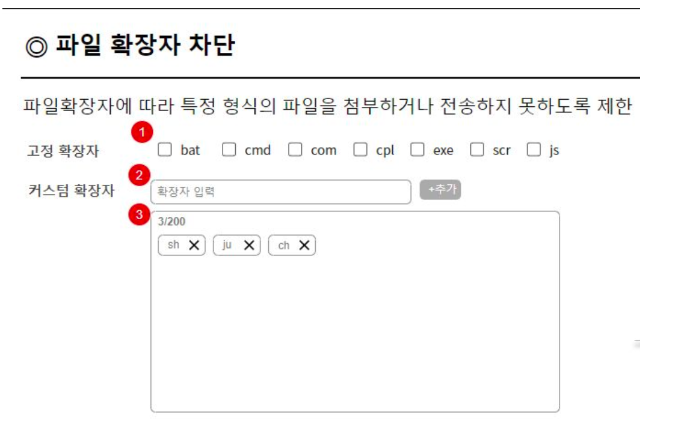
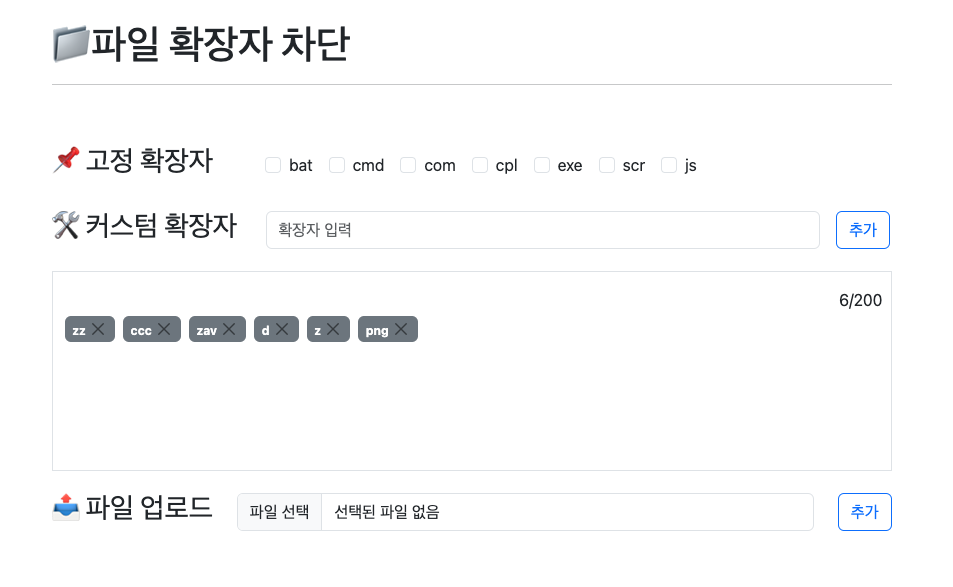

# flow-assignment

배포 주소 : https://extension-block.store/
api 문서 주소 : https://extension-block.store/static/docs/index.html

## 요구사항 분석

### 파일 확장자 차단 과제
- 화면 호출까지 구현한다

- 어떤 파일들은 첨부시 보안에 문제가 될 수 있다. 특히 exe, sh 등 실행파일 존재할 경우 서버에 올려 실행이 될 수 있는 위험이 있기에 파일 확장자 차단 기능이 필요하다.

### 요구사항
- 고정확장자 : 차단을 자주하는 확장자 리스트. dafault로 checkbox가 uncheck 되어 있다.
- 고정 확장자를 check or uncheck 할 경우 DB에 저장된다. -> 새로고침시 유지되어야 한다.

- 커스텀 확장자 최대 입력 길이는 20글자로 제한한다.
- 추가버튼 클릭시 DB에 저장되며, 아래쪽 영역에 표현된다.
- 커스텀 확장자는 최대 200개까지 추가 가능하다.
- 확장자 옆 x버튼을 클릭하면 DB에서 삭제가 가능하다.

- 위 요구사항 이외 어떤 점을 고려했는지 작성한다. 
    - 예를들어 커스텀 확장자 중복 체크. (커스텀 확장자 sh 추가 후 다시 sh 추가시 고려해 개발)

### 개발 Tool
- java 21 & springboot 3.3
  - 최신 개발 트렌드에 맞게 가장 최신 LTS 버전인 자바 21 선택했습니다.
- Frontend: vanilla javascript + bootstrap
  - jd를 참고해 별도의 라이브러리를 사용하지 않고 순수 자바스크립트로 개발했습니다.
  - 빠른 개발을 위해 bootstrap을 사용했으며 csr을 통한 새로고침 없이 즉각적으로 렌더링하도록 구현했습니다. 
- Database: MySQL
  - JD를 참고해 RDBMS 중 가장 많이 사용되는 MySQL를 선택했습니다. (Test 환경에서는 Memory DB인 H2 사용)
- 문서화 : Spring Rest docs
  - Controller에서 테스트를 강제함으로서 문서화를 자동화하기에 선택했습니다.

## 파일 확장자에 대한 검증

파일 확장자 검사시 확장자는 클라이언트에서 변경될 수 있기 때문에 확장자 뿐만 아니라, 서버에서 `파일 시그니처` 값을 검증 해 주어야 한다고 판단했습니다.

수많은 파일 유형에 대한 메타데이터와 텍스트 감지하기 위해  `apache tika`라는 라이브러리를 사용할 수 있지만, 과제인 것을 고려해 최대한 라이브러리를 사용하지 않고 구현해보자고 생각해 직접적으로 파일 시그니처에 대한 검증을 진행했습니다.

따라서 어떤 확장자에 대해 파일 시그니처 검증을 진행해야할지 고민한 결과, 모든 확장자에 대한 파일 시그니처 검증을 진행하기보다, 보안상으로 위험한 확장자 목록에 대해서 우선적으로 검증을 진행하면 되겠다고 판단하여 보안상으로 위험한 확장자 목록과 그에 대한 파일 시그니처 값을 추출해 enum으로 application단에서 관리 및 검증을 진행했습니다.

검증절차는 다음과 같습니다.

1. 보안상으로 위험한 확장자 목록을 enum으로 각 확장자와  파일 시그니처 값을 어플리케이션 레벨에서 관리합니다.
2. 파일 업로드시 먼저 차단 대상인 확장자에 대해 검증을 진행합니다. (고정 확장자 + 커스텀 확장자)
3. 이후 파일 차단 대상인 확장자와 같은 파일 시그니처 값을 가지고 있는지 검증을 진행합니다.
4. 검증에 통과가 되었다면 파일을 업로드 합니다. 통과되지 않았다면 예외를 통해 파일 업로드를 제한합니다.

- 파일 업로드시 저장 기능은 핵심에서 벗어난 것 같아 확장자 검증에 통과되면 파일 업로드에 성공했다는 alert 알림만 띄우도록 구현했습니다.

- 확장자를 클라이언트에서 조작해 차단된 확장자의 파일 시그니처 값을 가지고 있는 파일을 업로드하는 경우에 유저의 ip와 id값을 DB에 쌓아 추후 보안 이슈가 발생했을 때 추적할 수 있도록 구현했습니다.

- 인증 인가는 구현하지 않았지만 확장 가능한 구조로 엔티티 설계를 진행했습니다.
  - user별로 고정확장자 리스트 및 체크 여부, 커스텀 확장자 리스트를 관리할 수 있는 구조로 설계했습니다.

- Front와 Backend 모두에서 꼼꼼한 검증을 진행했습니다.
  - 도메인 분석을 통해 확장자는 중간에 공백이나 특수문자가 없는 영어와 한글조합으로 제한해 진행했습니다.
